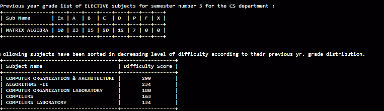
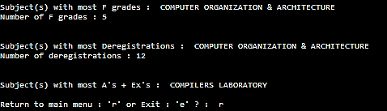

# CG-Accumulator
A console-based software to help accumulate CGPA / SGPA data and extract useful results for the students of IIT KGP.
 
### Important Features:
1. ######SEMESTER SUMMARISER

    Summarises the important aspects of a particular semester for a department 
    based on previous year grades. The important aspects include:
    - Know the average SGPA for the semester (based on previous year) to get a fair idea about the semester's difficulty level.
    - Generating the grade distribution data for all the depth subjects in the previous year
    - Generate list of all the breadth and elective courses that were actually taken up by previous year students.
    - Generate the grade distribution for these breadth and electives based on students of a particular department only.
    - Sort the depth subjects in decreasing order of 'difficulty' based on a normalised score calculated from the grade distribution.
    - Find the subject that recorded most deregistrations, helping students know in advance about courses that are strict with attendance.
    - Find the most scoring subject - based on number of A's + Ex's, or find the subject with most F's involved. 
 
2. ######DEPARTMENT RANKS
    - An important evaluation whenever a semester ends as the option to find the department rank 
      on the basis of SGPA achieved in most recent results is available.
    - CGPA based evaluation is also available.
    - Generating a department rank list for the entire batch on above parameters.
 
3. ######RECENT SGPA LISTS 
    - Helps to generate the SGPA list for the entire batch based on the most recent results.
 
4. ######OTHER FEATURES
    - Generate CGPA list for an entire batch.
    - Generate entire SGPA history for a batch / individual. Data from seniors helpful in identifying SGPA pitfalls.
    - Get individual performance for only a particular semester
    - Get performance link to a roll number without the birth date parameter.
    - KGP Election Special - Special feature to be added to be active only during elections in KGP to view academic records of candidates to avoid mud-slinging over false data. [To be added]


## Installation

#####Windows

###### If Python not Installed 
Download the zip file (4 MB) from [here](https://goo.gl/IJY0O7), extract and run CG-Acc.exe.

###### If Python Installed 

1. Make sure you have pip installed. Open cmd and enter the 'pip' command.
    If the 'pip is not recognized as an internal or external command' error shows up, download from this [link](https://drive.google.com/file/d/0B0uazFxiiqNYNTFWZ1doV2xRUDA/view?usp=sharing)
    Go the folder where the get-pip.py is downloaded and enter 'cmd' (without quotes) in the address bar.
    Enter the `python get-pip.py` command in the cmd that pops up.

    Enter the `setx PATH "%PATH%;C:\Python27\Scripts"` command and restart the command prompt.
    
2. Enter `pip install CG-Acc` command to download this software

3. Use `python -m CG-Acc` command to run the application.

#####Linux
1. Make sure you have Python 2.7 installed. Open the terminal and enter the 'python' (without quotes) command, if the python shell doesn't run, execute the following commands:

######Debian
```shell
$ sudo apt-get install python2.7
$ sudo apt-get install python-pip python-dev build-essential 
$ sudo pip install --upgrade pip 
$ sudo pip install --upgrade virtualenv 
```

######Fedora
```shell
$ sudo yum install python2.7 epel-release
$ sudo yum install -y python-pip
$ sudo pip install --upgrade pip 
$ sudo pip install --upgrade virtualenv 
```

2. Enter `pip install CG-Acc` command to download this software

3. Use `python -m CG-Acc` command to run the application.


###Working (Concise)
######Main Menu


######Semester Summariser
Function - Summarises important aspects of a semester acc. to prevoius year grades.

* Grade List for All Subjects


* All Electives taken up (with grade list), calculation of difficulty score (relative)



(PS : only 1 elective subject was available to this department for the 5th semester.)


* Other useful information




######Department Ranks

* Choice entered for department rank list based on most recent results


* Department Rank List for Entire Batch


* Individual Dep Rank based on recent results


* Individual Dep Rank based on CGPA


