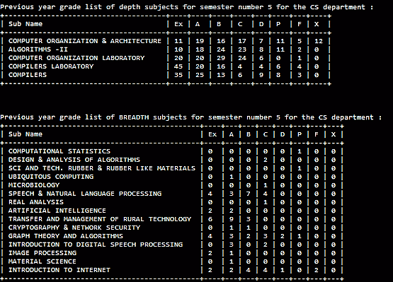
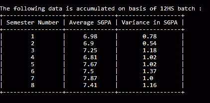
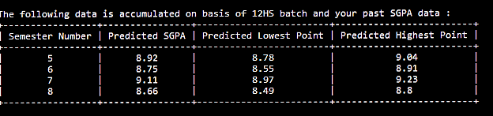
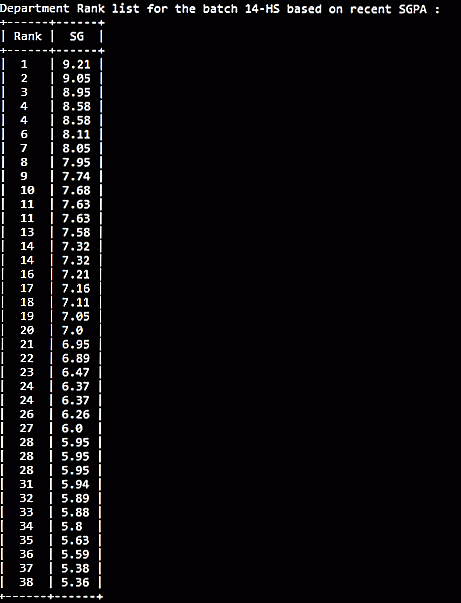
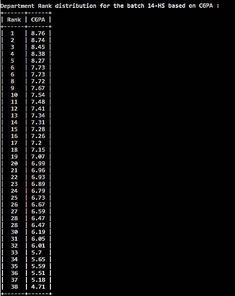

# CG-Accumulator
A console-based software to help accumulate CGPA / SGPA data and extract useful results for the students of IIT KGP.

## Installation

####Windows

###### If Python not Installed 
Download the zip file (4 MB) from [here](https://goo.gl/azxawv), extract and run CG-Acc.exe.

You might get a Windows Smart Screen warning, however you can click on 'More Info' and then 'Run Anyway'.

###### If Python and Pip Installed 
    
1. Enter `pip install CG-Acc` command to download this software

2. Use `python -m CG-Acc` command to run the application.


####Linux
1. Make sure you have Python 2.7 installed. Open the terminal and enter the 'python' (without quotes) command, if the python shell doesn't run, execute the following commands:

######Debian
```shell
$ sudo apt-get install python2.7
$ sudo apt-get install python-pip python-dev build-essential 
$ sudo pip install --upgrade pip 
$ sudo pip install --upgrade virtualenv 
```

######Fedora
```shell
$ sudo yum install python2.7 epel-release
$ sudo yum install -y python-pip
$ sudo pip install --upgrade pip 
$ sudo pip install --upgrade virtualenv 
```

2. Enter `pip install CG-Acc` command to download this software

3. Use `python -m CG-Acc` command to run the application.


 
### Important Features:
1. ######SEMESTER SUMMARISER

    Summarises the important aspects of a particular semester for a department 
    based on previous year grades. The important aspects include:
    - Know the average SGPA for the semester (based on previous year) to get a fair idea about the semester's difficulty level.
    - Generating the grade distribution data for all the depth subjects in the previous year
    - Generate list of all the breadth and elective courses that were actually taken up by previous year students.
    - Generate the grade distribution for these breadth and electives based on students of a particular department only.
    - Sort the depth subjects in decreasing order of 'difficulty' based on a normalised score calculated from the grade distribution.
    - Find the subject that recorded most deregistrations, helping students know in advance about courses that are strict with attendance.
    - Find the most scoring subject - based on number of A's + Ex's, or find the subject with most F's involved. 
 
2. ######DEPARTMENT RANKS
    - An important evaluation whenever a semester ends as the option to find the department rank 
      on the basis of SGPA achieved in most recent results is available.
    - CGPA based evaluation is also available.
    - Generating a department rank list for the entire batch on above parameters.
 
3. ######DEPARTMENTAL CGPA/SGPA PATTERN DETECTION
    - View average SGPA's and variances for all semesters of your department
    - Get a prediction of your SGPA for next semester based on previous year trends.
    - Get a prediction of your SGPA for all upcoming semesters based on the batch that has completed all semesters

4. ######OTHER FEATURES
    - KGP Election Special - Special feature to be added to be active only during elections in KGP to view academic records of candidates to avoid mud-slinging over false data. [To be added]

######Privacy Statement :
This software does not reveal any data such as SGPA / CGPA / Name / other grade related details for any student. The sole aim is to collect data and chalk out useful results and deductions for the benifit of the students. 


###Working (Concise)
######Main Menu


######Semester Summariser
Function - Summarises important aspects of a semester acc. to prevoius year grades.

* Grade List for All Subjects



* All Electives taken up (with grade list), calculation of difficulty score (relative)


(PS : only 1 elective subject was available to this department for the 5th semester.)


* Other useful information


######Departmental SGPA/CGPA Pattern Detection

* Average SGPA's and Variances for All Semesters of User's Department (Here - HS)



* Prediction for User's SGPA in Next Semester along with Lower and Upper Bounds 


* Prediction of User's Future SGPA's  (Here - User belongs to 14HS)

 


######Department Ranks

* Choice entered for department rank list based on most recent results


* Department Rank vs Recent SGPA for your Batch



* Department Rank vs CGPA for your Batch




